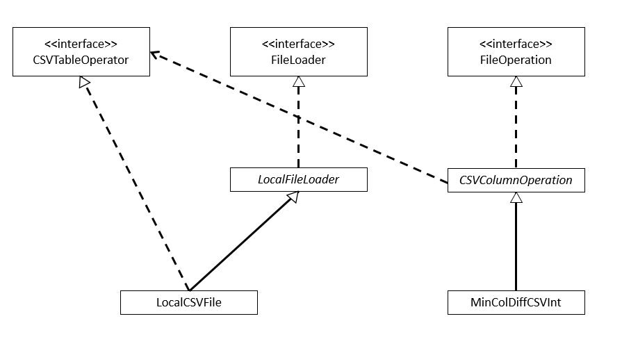

Dear all,

here is my solution of the weather challenge. 
I tried my best to separate and abstract the different steps and necessary operations for reusability.
Here is a small diagram which shows the connections between the classes:  

Best Regards  
Matthias Bauer

## Package overview
###### de.exccellent.core.interfaces
1. CSVTableOperator  
Used to define methods that any class which represents a loaded CSV file must offer in order to access row and column data.
It is used to abstract the way the data of the CSV is accessed since this can be done locally or over the web.
2. FileLoader  
Used to define methods that any class which loads a certain file from any location must offer.
It can be used to implement classes that abstract the access of different file types (web or locally).
3. FileOperation  
A special interface that defines methods for any class that wants to access a file and executes different, complex operations on the data. 
Here, the doOperation() method defines it's behavior.
The interface was chosen to reuse defined file operations such as calculating the row-wise difference of column values.

###### de.exccellent.core.classes              
1. LocalFileLoader  
Abstract class that implements the LoadFile() method from the FileLoader interface in order to provide the basic functionality for local file access. 
2. CSVColumnOperation 
Abstract class used to abstract types of FileOperation which only do operate on column values of a CSV file.
It contains methods to store and prepare column data values and provide the basic mechanisms which should be used by any column related operation.

###### de.exccellent.core.impl 
1. LocalCSVFile  
Inherits the LocalFileLoader class and implements the CSVTableOperator interface to load a locally stored CSV file and access it's data.
2. MinColDiffCSVInt  
Class which implements the FileOperation interface and inherits the CSVColumnOperation class in order to represent a reusable column based FileOperation which is executed on a CSV file. 
It calculates and returns the row-wise value (only Integers) difference of two given columns and finds the row with the minimum (absolute) difference. 

Tests have been added during implementation and in advance.  
Many functions using CSV data return strings, so that the data value must be cast into the specific wanted data type.

Further possible implementation considerations:
1. Use a different technique to open and access local files than a BufferedReader to cover more file types.
2. Change return value of some methods from null to other more meaningful ones.
3. Add a logger mechanism to remove the Sysout calls.
4. Account for different column data types which by automatically casting the right datavalue, e.g., in case of the FileOperation interface.
5. Use a mechanism to keep the same data object for different CSV files.